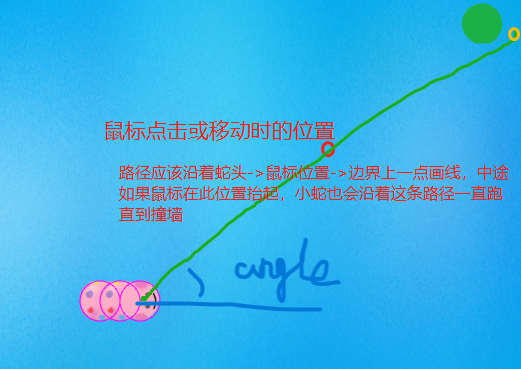
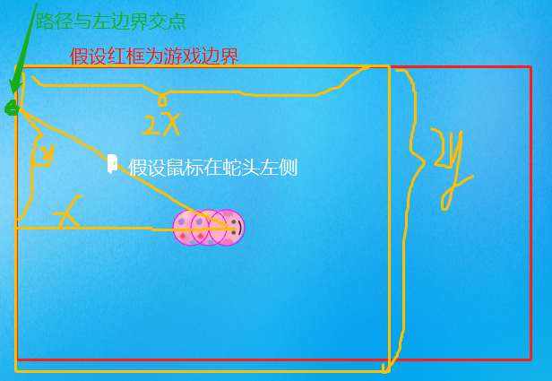
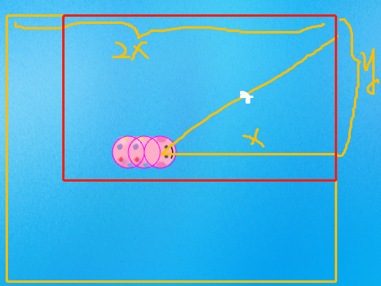
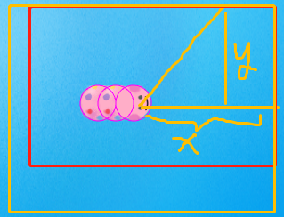
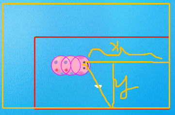
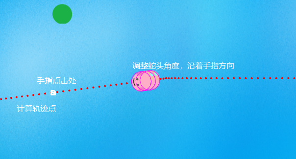

[主要代码](./src/scene/game.ts)

1. new Phaser.Game(config)

这里用的是arcade引擎

2. 先创建preload场景，加载一些资源，如果加载时间长，可以做一个进度条了
3. 创建游戏大厅，先放一个开始游戏按钮，点击切换到游戏场景先用scene.switch或者scene.start，后面改了，参考第10条
4. 创建游戏场景，先把背景、得分、小蛇、食物创建出来

这里使用setCircle设置贪吃蛇body为圆形

```ts
// 创建贪吃蛇
createSnake() {
  let img: PhysicsImage | PhysicsSprite
  const diameter = snakeRadius * 2
  // 因为我的贪吃蛇身体上有图案，看得出堆叠顺序，所以这里需要设置一下层级
  // 如果从最后一节身体往头部生成，初始贪吃蛇从头到尾每一节身体都在后一节身体的上边，但是后面增长的身体还是会叠在上面
  // 所以直接设置层级depth，要么蛇头设置一个很大的层级，蛇身依次depeth--，要么每次增长身体的时候需要重新设置，我这里用后者
  for (let i = 0; i < defaultBodies; i++) {
    if (i === 0) {
    	// 因为头部后面会执行动画，所以用sprite
      this.head = this.physics.add.sprite(0, 0, AssetKeys.Head1)

      img = this.head
      img.setCollideWorldBounds(true) // 边界碰撞
    } else {
      img = this.physics.add.image(0, 0, AssetKeys.Body)
    }

    img
      .setPosition(defaultX - bodyOffset * i, defaultY)
      .setDisplaySize(diameter, diameter)
      .setDepth(defaultBodies - i)
    img.setCircle(img.width / 2)
    this.snake.push(img)
  }
}
```

食物使用staticImage，并且也设置为圆形：

```ts
this.food = this.physics.add.staticImage(x, y, AssetKeys.Food)
this.food.setCircle(this.food.width / 2)

// 如果使用setSize设置GameObject的尺寸：
const diameter = foodRadius * 2
this.food = this.physics.add.staticImage(x, y, AssetKeys.Food).setSize(diameter, diameter)
// 需要将body的尺寸也设置成一致的
this.food.setBodySize(this.food.width, this.food.height)
this.food.setCircle(this.food.width / 2)

// 如果使用setDisplaySize设置显示的尺寸
const diameter = foodRadius * 2
this.food = this.physics.add.staticImage(x, y, AssetKeys.Food).setDisplaySize(diameter, diameter)
// body的坐标修改一下（尝试在setCircle中设置offset，但是StaticImage好像不会生效，所以这里换成改body坐标了）
this.food.body.center.set(x, y)
this.food.setCircle(foodRadius)
// 或者直接修改body的左上角坐标
// const { width, scale } = this.food
// const offset = (width / 2) * (1 - scale)
// this.food.body.x += offset
// this.food.body.y += offset
// this.food.setCircle((width * scale) / 2)
```

后面将食物单独创建为一个类[foot.ts](./src/objects/food.ts)

5. 监听鼠标/手指操作，计算顺着鼠标方向的路径

```ts
// 初始路径为界面蛇头位置延伸至右侧边界（即贪吃蛇默认向右移动）
// 这里也可以用new Phaser.Curves.Path等设置路径
this.path = new Phaser.Geom.Line(this.head.x, this.head.y, gameWidth, gameHeight / 2)
```

- 路径：
  计算蛇头（prevX, prevY）与鼠标(nextX, nextY)角度，然后从蛇头沿着这个角度画线一直到边界上一点，就是贪吃蛇应该移动的路径，顺便将蛇头的角度更新一下
  

- 路径与边界的交点，即路径的终点
  使用perimeterPoint(rect, angle, point)，需要保证蛇头在rect的中心点，然后沿着angle射向rect某条边上一点point，需要保证这点也在游戏边界上，假设白色为鼠标点，rect设置center为蛇头位置即可，关键是rect的宽高
  1. 假设鼠标点在蛇头左侧，则rect左边不超过游戏左边界，可以设置rect左边为游戏左边界，宽度为蛇头距左边界的2倍
     
  2. 假设鼠标在蛇头右侧，则rect右侧不超过游戏右边界，可以设置rect宽度为游戏右边界距蛇头距离的2倍
     
  3. 鼠标在蛇头上、下部也由上面类似的思想计算出rect的高度
     
     

或者以蛇头为中心，设置一个宽高为游戏界面2倍的矩形，这样算出的point点，角度是对的，但是会在游戏界面之外，这时可以设置边界碰撞使得贪吃蛇不会沿着轨迹点跑出界面

其实移动贪吃蛇也可以直接设置速度（根据路径终点位置和路径长度就可以计算）

```ts
// 根据蛇头和当前鼠标点位计算路径（连线延伸至边界）
caculatePath(nextX: number, nextY: number) {
  if (this.gameState === GameStateKeys.GameOver) return
  const { x: prevX, y: prevY } = this.head

  // 计算两点之间的角度
  const radius = Phaser.Math.Angle.Between(prevX, prevY, nextX, nextY)
  const angle = (radius * 180) / Math.PI
  this.head.angle = angle

  // 找到对应边界上的点
  const isLeft = prevX - nextX > 0
  const isTop = prevY - nextY > 0
  const width = isLeft ? prevX * 2 : (gameWidth - prevX) * 2
  const height = isTop ? prevY * 2 : (gameHeight - prevY) * 2
  const rect = new Phaser.Geom.Rectangle(0, 0, width, height)
  rect.centerX = prevX
  rect.centerY = prevY
  // PerimeterPoint(rect, angle[, point])可以获取在矩形rect的中点沿着angle角度对应周长上的点，输出到point里
  Phaser.Geom.Rectangle.PerimeterPoint(rect, angle, this.point)

  // 画线：当前蛇头位置->点击处->边界上的点
  this.path.setTo(prevX, prevY, this.point.x, this.point.y)

  this.getPoints()
}
```

6. 根据路径计算轨迹点，小蛇稍后会沿着轨迹点移动

```ts
// 根据路径长度获取轨迹点
getPoints() {
  this.points = this.path.getPoints(0, bodyOffset)

  this.points.push(this.point) // 边界上的点是最后一个轨迹点
}
```



7. 移动贪吃蛇（跟随轨迹点）

```ts
// 创建移动定时器
moveTimer = this.time.addEvent({
  delay: this.speed,
  loop: true,
  callback: () => this.moveSnake()
})

moveSnake() {
  if (this.gameState === GameStateKeys.GameOver) return

  // 贪吃蛇位置更新
  // 蛇头按points轨迹运行，蛇身依次移动到前一个蛇身位置
  // points[0]是蛇头当前位置，应该移动到下一个点(points[1])
  try {
    for (let i = this.snake.length - 1; i >= 0; i--) {
      if (i === 0) {
        this.snake[i].x = this.points[1].x
        this.snake[i].y = this.points[1].y
      } else {
        this.snake[i].x = this.snake[i - 1].x
        this.snake[i].y = this.snake[i - 1].y
      }
    }
  } catch (error) {
    this.gameOver()
    return
  }
  // 记录上一个轨迹点
  this.prevPoint = this.points[0]
  // 移动后丢弃轨迹第一个点
  this.points.shift()

  // 当移动到边界则游戏结束
  if (
    this.head.x <= this.head.width / 2 ||
    this.head.y <= this.head.height / 2 ||
    this.head.x >= gameWidth - this.head.width / 2 ||
    this.head.y >= gameHeight - this.head.height / 2
  ) {
    this.gameOver()
    return
  }
}
```

8. 检测蛇头和food碰撞，碰到就吃掉食物并得分

```ts
// 监听蛇头和食物碰撞
this.physics.add.overlap(this.food, this.head, this.eatFood, undefined, this)

// 吃到食物
eatFood() {
  // if (this.eating) return
  // this.eating = true
  // this.head.play(AnimationKeys.Eating).on('animationcomplete', () => {
  //   // 完成“吃”动作后再更新食物位置，但是效果不好
  //   this.updateFoodPos()
  //   this.eating = false
  // })
  // “吃”动画
  this.head.play(AnimationKeys.Eating)

  // 贪吃蛇身体增长一节
  this.createBody()
  // 得分
  this.addScore()

  // 吃了速度增加，这里我做了最快速度限制
  if (this.speed > gameConfig.fastSpeed + gameConfig.speedStep) this.speed -= gameConfig.speedStep
  else {
    this.speed = gameConfig.fastSpeed
  }

  // 因为我这里速度是通过this.time.addEvent控制，这里更新一下速度
  moveTimer.reset({
    delay: this.speed,
    callback: () => {
      this.moveSnake()
    },
    loop: true
  })

  this.updateFoodPos()
}
```

9. 更新食物位置

获取一个随机不与贪吃蛇重叠的位置（因为我界面上添加了得分文字，所以这里也检测了遮挡）

```ts
getRandomPos(
  snakePos: number[][],
  snakeDistance: number,
  scoreX: number,
  scoreY: number,
  scoreDistance: number
): [number, number] {
  this.checkOverlapCount++
  // 随机位置生成一个圆
  const randomX = Phaser.Math.Between(foodRadius, gameWidth - foodRadius)
  const randomY = Phaser.Math.Between(foodRadius, gameHeight - foodRadius)

  if (this.checkOverlapCount > 100) {
    // 如果这个函数被调用很多次，会报错：Maximum call stack size exceeded
    // 所以这里限制随机取100次都重叠，则直接返回该坐标
    // 也可以不返回这个会重叠的坐标，而是按某种规律找到一个不重叠的位置，例如从左到右、从上到下扫一遍，如果都没有不重叠的位置，说明贪吃蛇已经铺满屏幕了
    return [randomX, randomY]
  }
  // 食物不能被得分遮挡
  // 检测重叠也可以用：this.physics.world.intersects(body1, body2)等方法，这里我用自己实现的方法
  if (this.isOverlap(scoreX, scoreY, randomX, randomY, scoreDistance)) {
    return this.getRandomPos(snakePos, snakeDistance, scoreX, scoreY, scoreDistance)
  }
  // 检查贪吃蛇每一节是否与预生成的食物重叠
  const contain = snakePos.some(([x, y], i) => {
    return this.isOverlap(x, y, randomX, randomY, snakeDistance)
  })

  // 如果重叠，则重新生成一个随机位置
  if (contain) {
    return this.getRandomPos(snakePos, snakeDistance, scoreX, scoreY, scoreDistance)
  } else {
    return [randomX, randomY]
  }
}

// 判断是否重叠，圆心(x1, x2)与圆心(y1, y2)之间的距离是否大于distance
isOverlap(x1: number, y1: number, x2: number, y2: number, distance: number) {
  const [maxX, minX] = x1 > x2 ? [x1, x2] : [x2, x1]
  const [maxY, minY] = y1 > y2 ? [y1, y2] : [y2, y1]
  const x = maxX - minX
  const y = maxY - minY
  if (x > distance || y > distance) return false
  return Math.sqrt(x * x + y * y) < distance
}
```

10. 场景切换

```ts
// Phaser.Scenes.ScenePlugin
// 1. switch
this.scene.switch(SCENE_KEY) // 切换到指定场景SCENE_KEY = this.scene.start(SCENE_KEY) + this.scene.sleep()，也就是当前场景休眠，运行指定场景
                              // 下次场景管理器更新时执行，不会马上执行，下面除了setVisible都是

// 2. start
this.scene.start([SCENE_KEY, data]) // 关闭当前场景，运行指定场景

// 3. run
this.scene.run([SCENE_KEY]) // 运行指定场景，但是不会关闭当前场景，如果指定场景暂停/休眠/未运行，将会恢复/唤醒/运行

// 4. setVisible
this.scene.setVisible(bool[, SCENE_KEY]) // 切换指定场景显示状态

// 5. sleep/wake
this.scene.sleep([SCENE_KEY]) // 场景休眠（不更新，不渲染，但是不关闭）
this.scene.wake([SCENE_KEY]) // 唤醒场景 (starts update and render)
```

因为不想每次从游戏场景切换到其他场景都销毁游戏场景（下次切换回来还需要重建游戏场景中的对象），所以游戏场景第一次用start，之后每次setVisible，但是原来的场景还在，例如Main -> Game，Main场景里的开始按钮还在Game游戏场景界面中（只是不显示），在玩游戏的时候会点到按钮，就会重新开始游戏，可以每次切换到游戏场景场景就将Main场景休眠，要切换回来就wake或run一下
