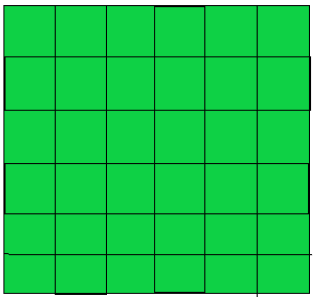
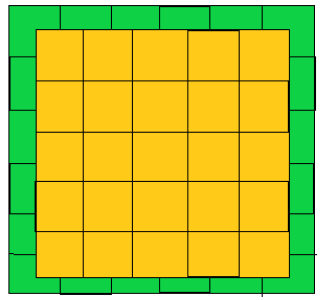
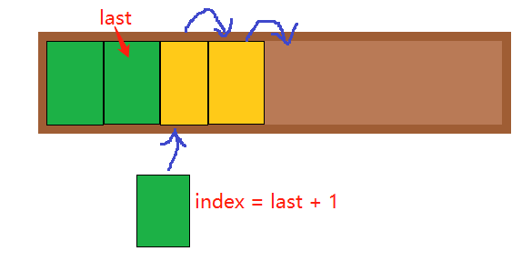
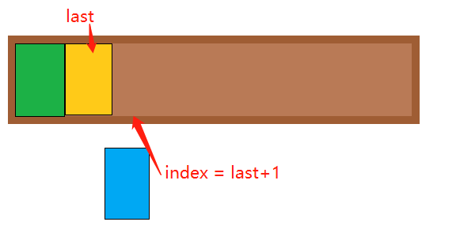
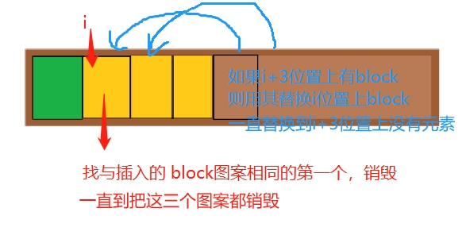

[主要代码](./src/scene/game.ts)

以下grid代表格子对象，block代表图案对象

## 1. 创建格子和图案

确定行数row、列数col、图层数level

每一层可放图案的格子有row \* col个

总共可放图案的格子有 row \* col \* level个

确定要放的图案种类blockTypes

确定每种图案要放多少组blockGroups

一共要放blockTypes \* blockGroups \* 3个图案

每一层平均放blockTypes \* blockGroups \* 3 / level个

可以每一层平均放也可以每一层放的数量不一样，但是**要确保每一层能放得下预计要放的，且总的图案数<=总的格子数**

**1.1 确定图案索引**

```ts
let keys = Array(blockTypes * blockGroups * 3)
  .fill(0)
  .map((_, i) => i % blockTypes)
// 例如2种图案blockTypes = 2，每种4组blockGroups = 4，总共 2 * 4 * 3个
// [0, 1, 0, 1, 0, 1, 0, 1, 0, 1, 0, 1, 0, 1, 0, 1, 0, 1, 0, 1, 0, 1, 0, 1]
```

**1.2 打乱顺序**

```ts
keys = this.shuffle(keys)
// [0, 0, 0, 1, 0, 1, 1, 1, 0, 1, 0, 0, 1, 1, 0, 0, 0, 1, 0, 1, 1, 1, 0, 1]
```

**1.3 确定每一层有多少个图案**

```ts
const counts = Array(level - 1)
  .fill(0)
  .map((_, i) => avarageCount) // 可以随即放，也可以按某种规律放
```

**1.4 创建格子**

```ts
/* 
grids: [
  // 第一层
  [
    // 第一行
    [
      // 每一列都是一个格子对象grid
      {}, {}, ...
    ]
    // 第二行...
  ]
  // 第二层...
]
*/
// 遍历图层
for (let l = 0; l < level; l++) {
  const levelGrids: Grid[][] = []
  const needOffset = l % 2 // 偶数层需要偏移
  const offset = needOffset ? 0.5 : 0 // 偏移图案一半
  for (let i = 0; i < rows; i++) {
    if (needOffset && i === rows - 1) continue // 偶数层少铺设一行
    for (let j = 0; j < cols; j++) {
      if (needOffset && j === cols - 1) continue // 偶数层少铺设一列
      const x = startX + blockWidth * (offset + j)
      const y = startY + blockHeight * (offset + i)
      if (!levelGrids[i]) {
        levelGrids[i] = []
      }

      levelGrids[i].push({
        // 格子对象
        x,
        y,
        row: i,
        col: j
      })
    }
  }
  grids[l] = levelGrids
}
```

第一层：



铺上第二层：



第2n+1层同第一层，第2n层同第二层

**1.5 每一层根据设定的图案数量，创建图案并在该层随机取一个格子挂上**

```ts
// 从当前层随机取一个格子(不重复)
const randomIndex = Phaser.Math.Between(0, grids.length - 1)
const grid = grids[randomIndex]
// 创建block
const { x, y } = grid
const block = new Block(
  this,
  x,
  y,
  AssetKeys[`Block${keys.pop()}` as keyof typeof AssetKeys],
  l + 1
)

// 将图案挂到格子上
grid.block = block
grids.splice(randomIndex, 1)
```

**1.6 遮挡图案放上阴影**

```ts
// 遍历所有格子，检查有图案的格子是否被遮挡，顶部被遮挡的要加阴影
checkOverlaps() {
  this.grids.forEach((levelGrids, l) => {
    const lastLevel = l === gameConfig.level - 1
    levelGrids.forEach((row) => {
      row.forEach((col) => {
        const block = col.block
        if (!block) return
        // 如果当前图案在最上层且有阴影，则删掉阴影
        if (lastLevel && block.shadow) {
          block.shadow?.destroy(true)
          block.shadow = undefined
        } else if (!lastLevel) {
          // 如果当前图案不在最上层，检查其上是否有遮挡
          const isOverlap = this.checkOverlap(col.row, col.col, l)
          // 如果没有遮挡（如果有阴影则删除阴影），返回
          if (!isOverlap) {
            if (block.shadow) {
              block.shadow.destroy(true)
              block.shadow = undefined
            }
            return
          }

          if (block.shadow) {
            // 如果有阴影，不用重复生成
            return
          }

          // 生成阴影
          const mask = this.add
            .rectangle(block.x, block.y, blockWidth, blockHeight, 0x000000, 0.5)
            .setDepth(block.depth)
          block.shadow = mask
        }
      })
    })
  })
}

// 判断图像有没有被遮挡
checkOverlap(row: number, col: number, level: number) {
  const currIsOffset = level % 2 // 当前这层是否偏移
  // 当前位置上面每一层都看看是否有遮挡
  for (let i = level + 1; i < gameConfig.level; i++) {
    const compareIsOffset = (i - level) % 2 // 两个图层之间是否相互偏移
    const levelGrids = this.grids[i]
    // 没有上面一层，则不会被遮挡
    if (!levelGrids || !levelGrids.some((row) => row.some((col) => col.block))) {
      continue
    }
    if (!compareIsOffset) {
      // 对比两个不偏移的图层，只需要对比当前格子正上方有没有格子
      // 这里可以返回true，也可以返回false，因为被不偏移的格子遮挡，会直接挡住，加不加阴影都无所谓
      if (levelGrids[row][col].block) return true
    } else {
      // 对比相互偏移的图层，需要看有没有四个角上的格子，每个格子上有没有图案，有1个就算遮挡
      const row1 = levelGrids[currIsOffset ? row : row - 1]
      const row2 = levelGrids[currIsOffset ? row + 1 : row]
      const col1 = currIsOffset ? col : col - 1
      const col2 = currIsOffset ? col + 1 : col
      if (row1 && (row1[col1]?.block || row1[col2]?.block)) {
        return true
      }
      if (row2 && (row2[col1]?.block || row2[col2]?.block)) {
        return true
      }
    }
  }
  return false
}
```

## 2. 鼠标点击事件

**2.1 监听block点击**

```ts
// 监听图案点击事件
block.on('pointerdown', () => {
  // 如果图案上没有阴影(最上面) && 允许点击
  if (!block.shadow && !this.unableClick && this.gameState === GameStateKeys.Running) {
    // 不能同时点击两个图案，先标记当前不可点击状态，然后设置当前点击图案放大，记录当前图案
    this.unableClick = true
    block.setScale(block.scaleX * 1.2, block.scaleY * 1.2)
    this.currentBlock = block
  }
})
block.on('pointerup', () => {
  // 如果是在当前图案上抬起
  if (this.currentBlock === block && this.gameState === GameStateKeys.Running) {
    this.selectBlock(block, grid)
  }
})

// 选中图案
selectBlock(block: Block, grid: Grid) {
  // 找到卡槽里合适的位置
  const pos = this.putBlockIntrough(block)
  const [x, y] = pos

  // 放到下方卡槽里
  block.x = x
  block.y = y

  // 放下block后检查是否需要合并
  this.checkMerge(block.key)
  this.unableClick = false
  // 卡槽满了
  if (this.troughBlocks.length >= troughConfig.troughCounts) {
    this.gameOver()
    return
  }
  if (!this.blockCounts) {
    // 赢了
    this.gameOver()
    return
  }

  // 删掉格子与图案的关联
  grid.block = null
  // 重新检查图案遮挡
  this.checkOverlaps()
}
```

**2.2 放置图案到卡槽**
从右往左找到第一个与block相同图案的索引last，block需要放到last+1位置，但是在放之前要先把last+1及之后位置上的图案（如果有的话）向后移动一格


如果卡槽里没有与block相同的图案，则直接将block放到最后


```ts
// 找到卡槽里适合放当前block的位置
putBlockIntrough(block: Block): [number, number] {
  // 从右往左找到与当前block图案相同的索引
  let last = this.troughBlocks.findLastIndex((b) => b.key === block.key)
  // 如果没找到，就用最右边的图案索引
  if (last <= -1) {
    last = this.troughBlocks.length - 1
  }
  // 放置当前block的索引 = 找到的索引下一个
  const index = last + 1
  // block的位置
  const x = this.trough.x + troughConfig.padding + blockWidth * (index + 0.5)
  const y = this.trough.y
  // 如果要放置的位置上已经有别的block了，则将这个位置及之后的block向右移动一格
  if (this.troughBlocks[index]) {
    const len = this.troughBlocks.length
    for (let i = len - 1; i >= index; i--) {
      this.troughBlocks[i].x += blockWidth
      this.troughBlocks[i + 1] = this.troughBlocks[i]
    }
  }
  // index上放block
  this.troughBlocks[index] = block
  return [x, y]
}
```

**2.3 检查卡槽里的图案合并**

如果卡槽里有三个与上面放置的block相同的图案，则合并


```ts
// 检查合并
checkMerge(key: string) {
  // 在卡槽中找到第一个和当前block key相同的图案索引
  const index = this.troughBlocks.findIndex((b) => b.key === key)
  const pos = this.troughBlocks.map((i) => i.x)
  // 如果该索引后第二个也是该图案（三个一样的key），则需要合并
  if (this.troughBlocks[index + 2]?.key === key) {
    // 从第一个key位置开始向右侧遍历
    const len = this.troughBlocks.length
    for (let i = index; i < len; i++) {
      let block: Block | undefined // 指向第i个block
      // 第i+3的位置上有block，则移除i位置上的block，将该i+3的block移到i位置上
      const hasMoveItem = i + 3 < len
      if (hasMoveItem) {
        const moveItem = this.troughBlocks[i + 3]
        // 合并的三个
        block = this.troughBlocks.splice(i, 1, moveItem)[0] // 用i后第三个替换i位置的元素
        this.tweens.add({
          targets: moveItem,
          x: pos[i], // 交换两者位置
          duration: 100,
          delay: 200
        })
      } else {
        block = this.troughBlocks[i]
      }
      // 合并的三个移出来销毁
      if (i < index + 3) {
        const mergeBlock = new MergeBlock(this, block.x, block.y)
        block.destroy(true)
        mergeBlock.play(AnimationKeys.Merge).on('animationcomplete', () => {
          mergeBlock.destroy(true)
        })
      }
    }
    // 修改卡槽和总的block数量
    this.blockCounts -= 3
    this.troughBlocks.length -= 3

    this.addScore()
  }
}
```

因为鼠标在图案上按下，图案就会放大，鼠标抬起时，不管在不在开始按下的图案上，都需要将放大的图案还原

```ts
this.input.on('pointerup', this.onPointerUp, this)

onPointerUp() {
  // 恢复格子样式
  this.currentBlock?.setDisplaySize(blockWidth, blockHeight)
  this.unableClick = false
  this.currentBlock = undefined
}
```
